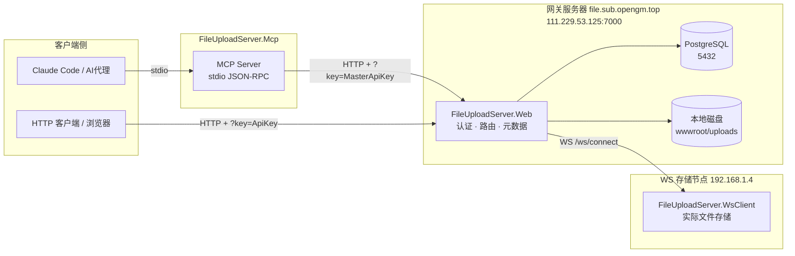
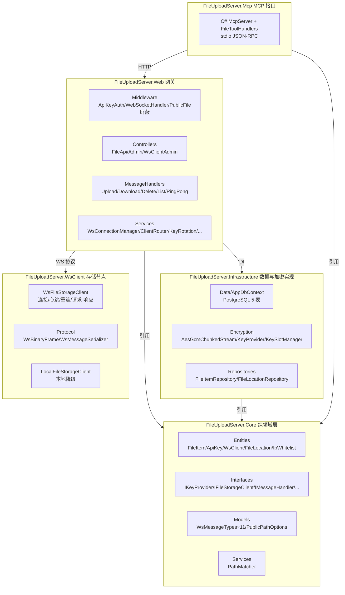

# FileUploadServer 项目框架与接口图

> 用途：理解整体架构——部署拓扑、分层结构、中间件管线、服务注册、数据库、WS 协议与全量接口总览。
> 创建：2026-08-02 | 关联：[00-overview.md](00-overview.md) / [02-api-reference.md](02-api-reference.md) / [07-ws-storage.md](07-ws-storage.md) / [08-mcp.md](08-mcp.md)

## 目录

1. [部署拓扑图](#部署拓扑图)
2. [分层结构图](#分层结构图)
3. [网关中间件管线](#网关中间件管线)
4. [DI 服务注册清单](#di-服务注册清单)
5. [数据库表结构](#数据库表结构)
6. [WS 协议：消息类型与帧格式](#ws-协议消息类型与帧格式)
7. [接口总览](#接口总览)
8. [核心请求流转](#核心请求流转)
9. [配置节清单](#配置节清单)

---

## 部署拓扑图



> 说明：网关（Web）不直接存文件，负责认证、路由、元数据；WS 节点（WsClient）负责实际磁盘 I/O；无 WS 节点时网关降级为本地存储。

## 分层结构图



## 网关中间件管线

请求进入 Web 网关后按顺序穿越（响应反向）。来源：`FileUploadServer.Web/Program.cs`。

```
请求入口
   │
   ▼
① Swagger 中间件 (UseSwagger / UseSwaggerUI)     —— /swagger 文档页
   ▼
② ExceptionHandler (仅非 Development)            —— 全局异常 → /Error
   ▼
③ HSTS (仅非 Development)
   ▼
④ HttpsRedirection
   ▼
⑤ RateLimiter (内置固定窗口)                      —— public-file-ip: 100/min, 队列10
   ▼
⑥ [PublicFileMiddleware — 已屏蔽 2026-08-02]       —— /p/ 匿名访问，注释停用
   ▼
⑦ UseWebSockets (KeepAliveInterval=30s)
   ▼
⑧ WebSocketHandlerMiddleware                       —— 拦截 GET /ws/connect
   │   认证 → 升级WS → 注册连接池 → ReceiveLoop
   ▼
⑨ StaticFiles (wwwroot)
   ▼
⑩ ApiKeyAuthMiddleware                             —— 跳过 /api/admin /api/public /p/
   │   query|form key → 校验 → 存入 HttpContext.Items["CurrentApiKey"]
   ▼
⑪ Routing
   ▼
⑫ Authorization
   ▼
⑬ Controllers (MapRazorPages + MapControllers)
```

## DI 服务注册清单

来源：`FileUploadServer.Web/Program.cs`。

| 生命周期 | 服务 | 职责 |
|---|---|---|
| Scoped | `IFileItemRepository` → `FileItemRepository` | 文件项仓储 |
| Scoped | `IPermissionService` → `PermissionService` | 文件访问权限过滤 |
| Scoped | `IIpWhitelistService` → `IpWhitelistService` | IP 白名单校验 |
| Scoped | `WsClientAuthService` | WS 连接 token 认证 |
| Scoped | `IMessageHandler` ×5 | Upload/Download/Delete/List/PingPong 处理器 |
| Scoped | `IStorageStrategyFactory` → `StorageStrategyFactory` | 按路径选存储策略 |
| Scoped | `LocalStorageStrategy` | 本地磁盘读写 |
| Scoped | `WsStorageStrategy` | 经 WS 转发远程存储 |
| Singleton | `IKeyProvider` → `KeyProvider` | AES-256-GCM 主密钥 |
| Singleton | `KeySlotManager` | 多密钥槽 / 恢复口令 |
| Singleton | `PathMatcher` | Glob 路径匹配 |
| Singleton | `IPublicFileRateLimiter` → `PublicFileRateLimiter` | 三层限流 |
| Singleton | `WsConnectionManager` | WS 连接池 |
| Singleton | `ClientRouter` | 多客户端路由（4 策略） |
| Hosted | `BackgroundCleanupService` | 每小时清理过期密钥+文件 |
| Hosted | `KeyRotationService`（仅非 CLI 模式） | 每日密钥轮换 |

## 数据库表结构

来源：`FileUploadServer.Infrastructure/Data/AppDbContext.cs` + `sql/complete_schema.sql`（PostgreSQL，5 张表）。

| 表 | 实体 | 关键字段 |
|---|---|---|
| `Files` | FileItem | Id, FileName, StoredFileName, FileSize, ContentType, UploadedAt, ApiKeyId(FK), EncryptionVersion, KeyVersion, DiskFileName, FileHash, BlockSize, IsPublic, PublicPath, StorageMode(Local/WebSocket/Hybrid), ClientId, StoragePath |
| `ApiKeys` | ApiKey | Id, Key, Description, CreatedAt, ExpiresAt, IsDeleted, KeyType(Admin=1/Temporary=2) |
| `WsClients` | WsClient | Id, ClientSecretHash(SHA256), IsEnabled, PathPrefixes, StorageCapacity(-1=不限), CurrentStorage, LastConnectedAt |
| `FileLocations` | FileLocation | Id(Guid), FilePath, FileName, FileSize, FileHash, ClientId, ApiKeyId, IsPublic, ExpiresAt |
| `IpWhitelists` | IpWhitelist | Id, IpAddress, Description, IsEnabled |

关系：`Files.ApiKeyId → ApiKeys.Id`（外键，ON DELETE SET NULL）。
预留：`StorageConfigs`（Hybrid 模式路径路由，已注释待启用）。

## WS 协议：消息类型与帧格式

### 消息类型（11 种，JSON 文本帧，`Type` 字段路由）

来源：`FileUploadServer.Core/Models/WsMessageTypes.cs`。

| 方向 | 消息类型 | 载荷 |
|---|---|---|
| 网关→节点 | `upload_request` | Path, FileName, FileSize |
| 节点→网关 | `upload_ack` | Code, Message |
| 节点→网关 | `upload_complete` | FileHash, FileSize, Code, Message |
| 网关→节点 | `download_request` | Path |
| 网关→节点 | `download_data`（二进制帧） | ChunkIndex, TotalChunks |
| 网关→节点 | `download_complete` | Code, Message |
| 网关→节点 | `delete_request` | Path |
| 节点→网关 | `delete_complete` | Code |
| 双向 | `ping` / `pong` | 心跳 |
| 双向 | `error` | Code, Message |

另有 `list_request` / `list_response`（ListRequestHandler 使用）。

### 二进制帧格式（文件数据分块，24 字节帧头）

来源：`FileUploadServer.WsClient/Protocol/WsBinaryFrame.cs`，分块大小 64KB。

```
┌──────────────────────────────────────────────────────────────┐
│ WsBinaryFrame 帧头（24 字节）                                  │
├───────────────────┬──────────────────────────────────────────┤
│ Offset 0   (16B)  │ requestId (Guid)                        │
│ Offset 16   (4B)  │ chunkIndex (uint32, 大端)                │
│ Offset 20   (4B)  │ totalChunks (uint32, 大端)               │
│ Offset 24  (var)  │ payload（数据块，≤64KB）                  │
└───────────────────┴──────────────────────────────────────────┘
常量：HeaderSize=24, ChunkSize=65536, MaxPayloadSize=1MB
```

### 加密文件头格式（48 字节）

来源：`FileUploadServer.Infrastructure/Encryption/AesGcmChunkedStream.cs`。

```
┌──────────────────────────────────────────────────────────────┐
│ AesGcmEncryptStream 文件头（48 字节）                          │
├───────────────┬──────────────────────────────────────────────┤
│ Offset 0 (4B) │ Magic "FUEC"                                 │
│ Offset 4 (2B) │ FormatVersion = 0x0001                       │
│ Offset 6 (2B) │ KeyVersion                                   │
│ Offset 8 (4B) │ BlockSize（默认 1MB）                         │
│ Offset 12(36B)│ 保留                                          │
├───────────────┴──────────────────────────────────────────────┤
│ 数据块 × N：                                                  │
│ [Nonce 12B][AES-256-GCM 密文][AuthTag 16B] 每块 overhead 28B │
└──────────────────────────────────────────────────────────────┘
```

## 接口总览

### HTTP API（23 端点，详见 02-api-reference.md）

| 类别 | 端点 | 数量 |
|---|---|---|
| 文件操作 | `api/files` 系 | 5 |
| 密钥管理（localhost） | `api/admin/keys` 系 | 4 |
| 文件公开管理 | `api/admin/files/*` + `api/public/files` | 4 |
| IP 白名单（localhost） | `api/admin/whitelist` 系 | 3 |
| 公网密钥申请 | `api/public/keys` | 1 |
| WS 客户端管理（localhost） | `api/admin/ws-clients` 系 | 6 |

### WebSocket（网关 ↔ 存储节点）

- 端点：`GET /ws/connect?clientId=&token=&timestamp=&prefixes=`
- 认证：`token = SHA256(clientId + SHA256(clientSecret) + timestamp)`，时间戳 ±5 分钟
- 双通道：控制（JSON 文本帧）+ 数据（二进制帧）
- 心跳 30s / 超时 60s 注销 / 指数退避重连

详见 [07-ws-storage.md](07-ws-storage.md)。

### MCP 工具（6 个，stdio JSON-RPC，详见 08-mcp.md）

| 工具 | 对应 HTTP | 说明 |
|---|---|---|
| `file_list` | GET /api/files | 文件列表 |
| `file_info` | GET /api/files/{id} | 文件元数据 |
| `file_upload` | POST /api/files | 上传 |
| `file_download` | GET /api/files/download/{id} | 下载（Base64） |
| `file_delete` | DELETE /api/files/{id} | 删除 |
| `file_set_public` | PUT /api/admin/files/{id}/public | 设置公开 |

## 核心请求流转

### HTTP 上传（带透明加密）

```
客户端 ──POST /api/files?key=xxx + multipart──► FileApiController.Upload
                                                   │
                                            StorageStrategyFactory.GetStrategy(path)
                                                   │
                                    ┌──────────────┴──────────────┐
                                    ▼                             ▼
                        LocalStorageStrategy              WsStorageStrategy
                        AesGcmEncryptStream              发 upload_request → 节点
                        (落地即密文)                      二进制帧分块 → upload_complete
                                    │                             │
                                    ▼                             ▼
                              Files 记录 +              FileLocations 记录
                              StorageMode=Local        StorageMode=WebSocket
```

### HTTP 下载（流式透明解密）

```
客户端 ──GET /api/files/download/{id}?key=xxx──► FileApiController.Download
                                                   │ CanAccessFileAsync 权限检查
                                                   │
                                    ┌──────────────┴──────────────┐
                                    ▼                             ▼
                        LocalStorageStrategy              WsStorageStrategy
                        AesGcmDecryptStream              发 download_request
                        (边读边解密边输出)                二进制帧 → 解密 → 输出
```

### WS 节点上传时序

```
节点(WsClient)                  网关(Web)
     │   upload_request           │
     ├───────────────────────────►│ 路径检查 → 建临时文件
     │   upload_ack(totalChunks)  │
     │◄───────────────────────────┤
     │   二进制帧 ×N (64KB)        │ 写入 PendingUpload
     │   ────────────────────────►│
     │   upload_complete(hash)    │ 计算SHA256 → 存目标存储 → FileLocation
     │◄───────────────────────────┤
```

## 配置节清单

来源：`FileUploadServer.Web/appsettings.json` + `FileUploadServer.Mcp/appsettings.json`。

| 配置节 | 说明 |
|---|---|
| `ConnectionStrings:DefaultConnection` | PostgreSQL 连接串 |
| `Storage:Mode` | Local / WebSocket / Hybrid |
| `Storage:LocalPath` | 本地存储目录 |
| `Storage:Routes` | 路径路由规则（StorageStrategyFactory 加载） |
| `PublicPath:Patterns` | 公共路径模式（如 `/public/*`） |
| `PublicPath:MaxFileSize` | 公共文件上限（默认 50MB） |
| `PublicPath:CacheControl` | 缓存头（默认 7 天） |
| `PublicPath:RateLimit` | PerIpPerMinute=100 / PerFilePerMinute=20 / ConcurrentDownloads=50 |
| `Encryption:KeyFilePath` | 加密密钥文件路径 |
| `McpServer:FileServerBaseUrl` | MCP 目标网关地址（默认 localhost:5000） |
| `McpServer:MasterApiKey` | MCP 使用的 Admin 密钥（必填） |
| `McpServer:RequestTimeoutSeconds` | 大文件超时（默认 300s） |
| `McpServer:MaxRetries` | 5xx 重试次数（默认 2） |
